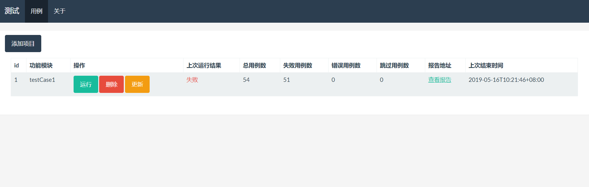

### 练手项目 ### 
用来触发现有自动化用例，并显示最近一次运行结果与html格式报告

### 目录结构 ### 
1. 在online_cases统计目录下增加cases、logs目录，cases用来放现有自动化用例，logs记录每次运行的记录  
2. data.db使用sqlite，仅用来记录自动化用例的目录、报告地址以及最近一次运行结果  

### 安装&运行 ###
1. 基于Python2
2. pip install -r requirmnts.txt
3. python run -m flask  
4. 当前适用于Linux/windows环境

### 后续优化 ###
1. 历史运行记录
2. 正则方式筛选日志显示结果  
3. 登录&远程触发
